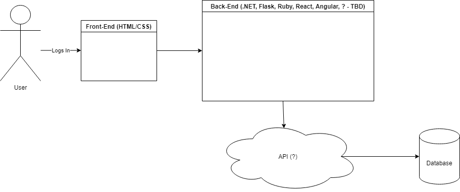
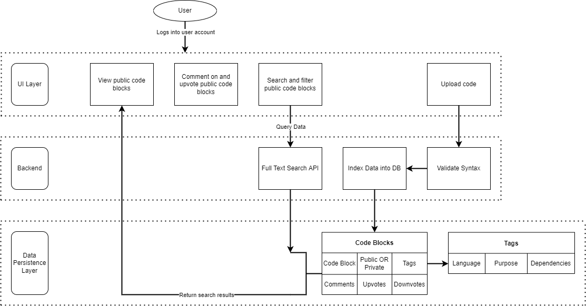

# Design Diagrams

### D0

#### Explanation
User - This represents the end-user or system-user that will be making use of the web application.

Web Application - This represents the core web application that will store the user defined code snippets, comments, etc.

Input - There are three primary inputs the web application will take...
1. Code snippet accompanied by description and title.
2. Comments/Reviews of another user's public code snippet.
3. Search term and filters to find desired code from end-user's private snippets or other user's public snippets.

Output - The primary output will be the end-user's public/private snippets or filtered snippets from other users. 

### D1

### D2

