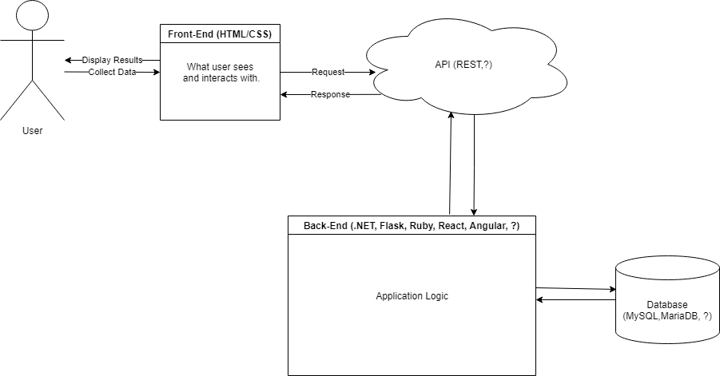

# Design Diagrams

## D0

### Explanation
User - This represents the end-user or system-user that will be making use of the web application.

Web Application - This represents the core web application that will store the user defined code snippets, comments, etc.

Input - There are three primary inputs the web application will take...
1. Code snippet accompanied by description and title.
2. Comments/Reviews of another user's public code snippet.
3. Search term and filters to find desired code from end-user's private snippets or other user's public snippets.

Output - The primary output will be the end-user's public/private snippets or filtered snippets from other users. 

## D1

## D2

### Explanation
Our user will log into their account or register one if they do not have one, and they will see the UI Layer.

UI Layer
1. Here the user will be able to view any code blocks that have been uploaded by other users and been made publicly available
2. Comment and vote on those publicly available code blocks
3. Search for specific code blocks and filter those searches as well
4. Upload their own code for storage where they can add the meta data to it and make it either private or public

Backend
1. First set of APIs will be for our full text search functionality allowing users to search and filter the search results
2. Second set will be to insert code that they the user has uploaded into our database for storage
3. Third API will be to validate the user's uploaded code syntax via a third party, open source API

Data Persistence Layer
1. Will have a database setup in Elasticsearch which offers full text search capabilities
2. Will store user code blocks in the database and each block will have metadata on it such as availability (public/private), tags, comments, and vote count
3. The tag list will be a predefined list of tags that the user will get to choose from when uploading their code, and that list will include but is not limited to language, puprpose, dependencies