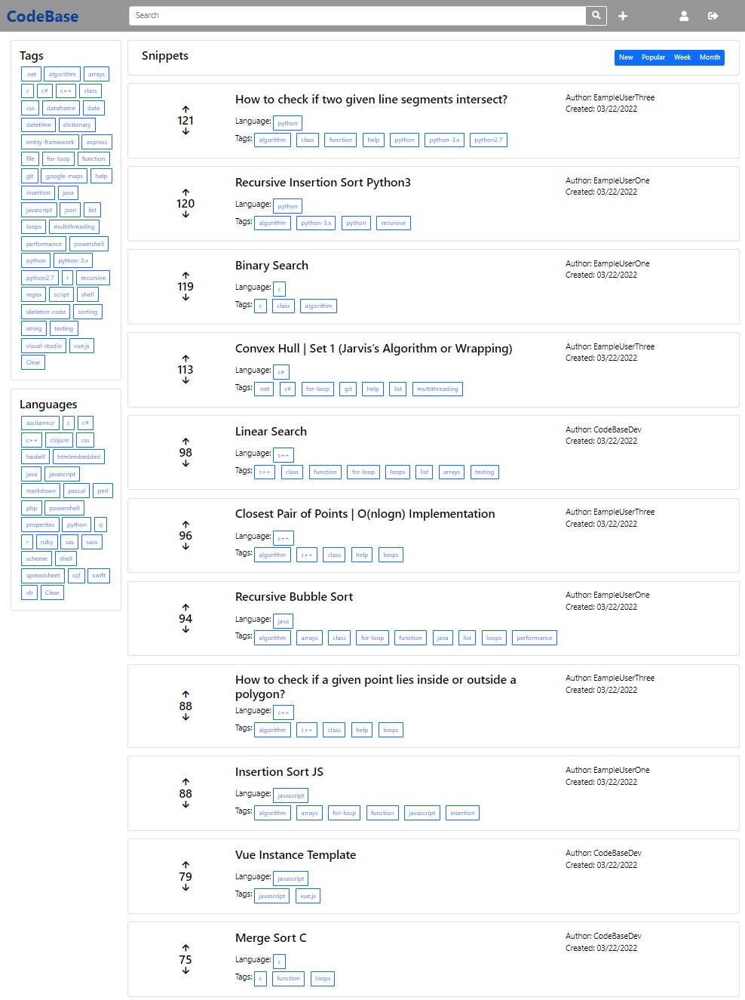
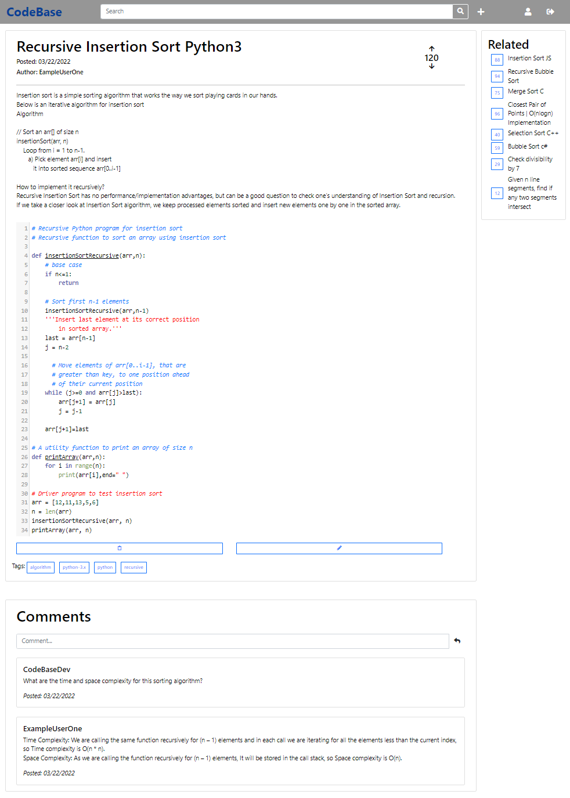
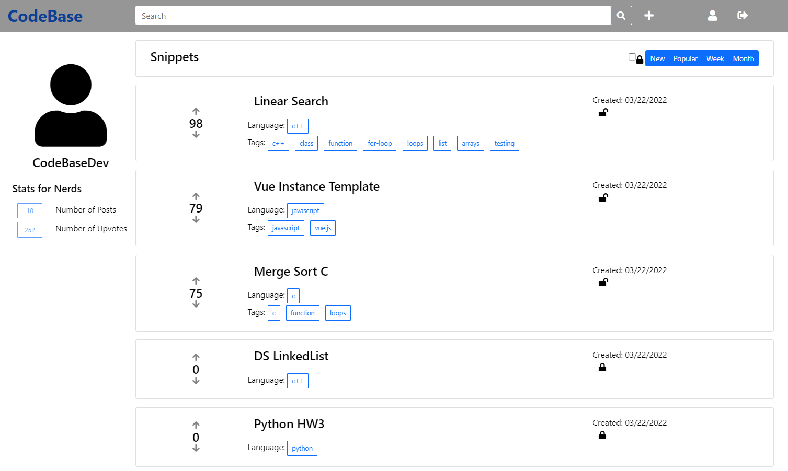
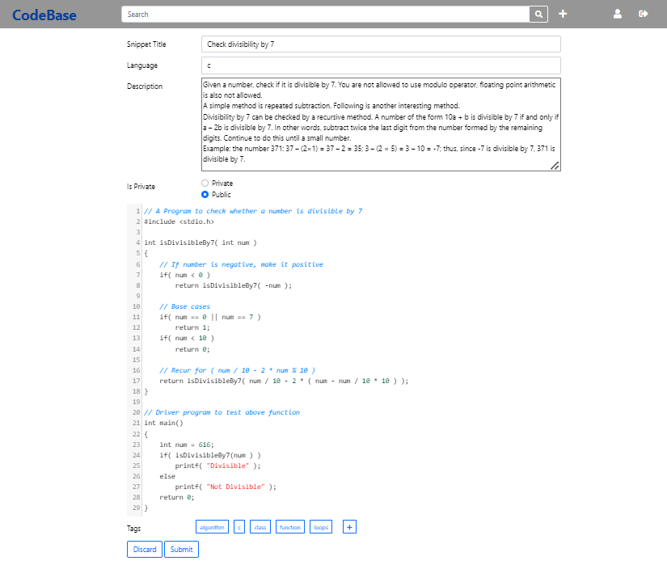

# Codebase Test Plan

## Overall Test Plan

For Codebase, our testing plan primarily focuses on initially testing each component individually with test data. These tests will be used to test standard features in the web application with both correct and incorrect usage to assure proper error handling given invalid information. This will be carried out on front end components and back-end components separately. Once these initial tests are completed, our team will move onto testing the applications ability to communicate and work cohesively. Finally we will stress test our application by inputting a large number of records to assure proper functionality and usability. 

## Test Case Descriptions
<br>**UI-T1.1**  - **User Interface Test 1**
<br>**UI-T1.2**  - This test will be used to assure a given users ability to sign-up/sign-in to the application.
<br>**UI-T1.3**  - This test will be carried out by navigating to the login page for the application. This page will be the redirect of any web page for on the site for an unauthenticated user. When on the login-in screen the user will be prompted for a username and password, they will provide valid credentials. From there they will be able to navigate the site freely.
<br>**UI-T1.4**  - Inputs: Valid user credentials
<br>**UI-T1.5**  - Output: Successful login
<br>**UI-T1.6**  - Normal
<br>**UI-T1.7**  - Blackbox
<br>**UI-T1.8**  - Functional
<br>**UI-T1.9**  - Unit Test

<br>**UI-T2.1**  - **User Interface Test 2**
<br>**UI-T2.2**  - This test will be used to assure a given users ability to sign-up/sign-in to the application.
<br>**UI-T2.3**  - This test will be carried out by navigating to the login page for the application. This page will be the redirect of any web page for on the site for an unauthenticated user. When on the login-in screen the user will be prompted for a username and password, they will provide invalid credentials. This request will be denied and the user will be asked for correct credentials.
<br>**UI-T2.4**  - Inputs: invalid user credentials
<br>**UI-T2.5**  - Output: Unsuccessful login
<br>**UI-T2.6**  - Normal
<br>**UI-T2.7**  - Blackbox
<br>**UI-T2.8**  - Functional
<br>**UI-T2.9**  - Unit Test

<br>**UI-T3.1**  - **User Interface Test 3**
<br>**UI-T3.2**  - This test will focus on assuring the functionality and display of the home page.
<br>**UI-T3.3**  - Once logged-in, users will be redirected to the home screen. This will feature display of different code snippets and filters.
<br>**UI-T3.4**  - Input: Logged-in user
<br>**UI-T3.5**  - Output: Correct display and functionality of home page mechanics
<br>**UI-T3.6**  - Normal
<br>**UI-T3.7**  - Blackbox
<br>**UI-T3.8**  - Functional
<br>**UI-T3.9**  - Unit Test

<br>**UI-T4.1**  - **User Interface Test 4**
<br>**UI-T4.2**  - This test will focus on assuring the functionality and display of the snippet page.
<br>**UI-T4.3**  - Once logged-in, users will be redirected to the home screen. This will feature display of different code snippets and filters. From there, users can redirect to any code snippet displayed or searched for. This page will display the code snippet along with its description. Users will be able to copy the code, comment, vote, and redirect to similar posts.
<br>**UI-T4.4**  - Input: Logged-in user and snippet
<br>**UI-T4.5**  - Output: Functional snippet display screen
<br>**UI-T4.6**  - Normal
<br>**UI-T4.7**  - Blackbox
<br>**UI-T4.8**  - Functional
<br>**UI-T4.9**  - Unit Test

<br>**UI-T5.1**  - **User Interface Test 5**
<br>**UI-T5.2**  - This test will focus on assuring the functionality and display of the user page.
<br>**UI-T5.3**  - Once logged-in, users will be redirected to the home screen. This will feature display of different code snippets and filters. They will be able to navigate to their profile page, here they can see all their posts along with user stats.
<br>**UI-T5.4**  - Input: Logged-in user
<br>**UI-T5.5**  - Output: Functional user display screen
<br>**UI-T5.6**  - Normal
<br>**UI-T5.7**  - Blackbox
<br>**UI-T5.8**  - Functional
<br>**UI-T5.9**  - Unit Test

<br>**UI-T6.1**  - **User Interface Test 6**
<br>**UI-T6.2**  - This test will focus on assuring the functionality of adding a new snippet.
<br>**UI-T6.3**  - Once logged-in, users will be redirected to the home screen. They will be able to navigate to their user page, here they will be able to create a new snippet. Featuring code, a title, description, and the ability to private the code snippet.
<br>**UI-T6.4**  - Input: Logged-in user
<br>**UI-T6.5**  - Output: Functional addition of snippet
<br>**UI-T6.6**  - Normal
<br>**UI-T6.7**  - Blackbox
<br>**UI-T6.8**  - Functional
<br>**UI-T6.9**  - Unit Test

<br>**API-T1.1**  - **API Test 1**
<br>**API-T1.2**  - Assure our indexing API properly indexes new data into the database
<br>**API-T1.3**  - Call the indexData API and ensure that the data is properly indexed into the data base and can be accessed
<br>**API-T1.4**  - JSON object: code snippet as a string, boolean for isPublic, and list of tags as strings
<br>**API-T1.5**  - 204 HTTP code
<br>**API-T1.6**  - Normal
<br>**API-T1.7**  - Blackbox
<br>**API-T1.8**  - Functional
<br>**API-T1.9**  - Unit Test

<br>**API-T2.1**  - **API Test 2**
<br>**API-T2.2**  - Assure our voting APIs properly add the vote objects to the database and increment the correct value
<br>**API-T2.3**  - Call the upVote API on a code snippet and check that the all values are properly updated
<br>**API-T2.4**  - Route variables: codeGuid (Unique ID for code snippets) and postType (whether the item being upvoted is a code snippet or a comment)
<br>**API-T2.5**  - 204 HTTP code
<br>**API-T2.6**  - Normal
<br>**API-T2.7**  - Blackbox
<br>**API-T2.8**  - Functional
<br>**API-T2.9**  - Unit Test

<br>**API-T3.1**  - **API Test 3**
<br>**API-T3.2**  - Assure our voting APIs propery add the vote objects to the database and decrement the correct value
<br>**API-T3.3**  - Call the downVote API on a code snippet and check that all values are properly updated
<br>**API-T3.4**  - Route variables: codeGuid (Unique ID for code snippets) and postType (whether the item being upvoted is a code snippet or a comment)
<br>**API-T3.5**  - 204 HTTP code
<br>**API-T3.6**  - Normal
<br>**API-T3.7**  - Blackbox
<br>**API-T3.8**  - Functional
<br>**API-T3.9**  - Unit Test

<br>**API-T4.1**  - **API Test 4**
<br>**API-T4.2**  - Assure the comment API adds a new user comment to the proper code snippet in the database
<br>**API-T4.3**  - Call the createComment API on a code snippet and check that all values are properly updated
<br>**API-T4.4**  - JSON object: comment text. Route variables: codeGuid
<br>**API-T4.5**  - 204 HTTP code
<br>**API-T4.6**  - Normal
<br>**API-T4.7**  - Blackbox
<br>**API-T4.8**  - Functional
<br>**API-T4.9**  - Unit Test

<br>**API-T7.1**  - **API Test 5**
<br>**API-T7.2**  - Assure the full text search API returns the proper results
<br>**API-T7.3**  - Call the search API and verify returned results are the desired results
<br>**API-T7.4**  - JSON object: search string, list of filters
<br>**API-T7.5**  - 200 HTTP code and search results
<br>**API-T7.6**  - Normal
<br>**API-T7.7**  - Blackbox
<br>**API-T7.8**  - Functional
<br>**API-T7.9**  - Unit Test

<br>**S-T1.1** - **Security Test 1**
<br>**S-T1.2**  - Assure user credentials are encrypted in transit and storage
<br>**S-T1.3**  - Register a new user and ensure that the provided credentials are properly encrypted and stored into the database as ciphertext
<br>**S-T1.4**  - Plaintext user credentials
<br>**S-T1.5**  - Encrypted credentials stored in the database
<br>**S-T1.6**  - Normal
<br>**S-T1.7**  - Blackbox
<br>**S-T1.8**  - Functional
<br>**S-T1.9**  - Unit Test

<br>**S-T2.1** - **Security Test 2**
<br>**S-T2.2**  - Assure user passwords are masked by default when displayed 
<br>**S-T2.3**  - Register a new user and ensure that the provided password is masked when being typed into the password textbox
<br>**S-T2.4**  - Alphanumeric plaintext password
<br>**S-T2.5**  - Masked characters displayed in place of password
<br>**S-T2.6**  - Normal
<br>**S-T2.7**  - Blackbox
<br>**S-T2.8**  - Functional
<br>**S-T2.9**  - Unit Test

<br>**S-T3.1** - **Security Test 3**
<br>**S-T3.2**  - Lock out user after 10 failed login attempts
<br>**S-T3.3**  - Attempt to log in as a user with the wrong password 10 times and then try again with the correct password
<br>**S-T3.4**  - 10 failed login attempts, and then an additional attempt
<br>**S-T3.5**  - A message informs the user that their account has been blocked until an hour passes or they reset their password.
<br>**S-T3.6**  - Normal
<br>**S-T3.7**  - Blackbox
<br>**S-T3.8**  - Functional
<br>**S-T3.9**  - Unit Test

<br>**S-T4.1** - **Security Test 4**
<br>**S-T4.2**  - Require passwords to be alphanumeric, > 5 characters, and contain a special character
<br>**S-T4.3**  - Attempt to register a user with the password Test and verify that an error is displayed
<br>**S-T4.4**  - Register user with password Test
<br>**S-T4.5**  - A message informs the user that their password must be longer than 5 characters and contain a special character.
<br>**S-T4.6**  - Normal
<br>**S-T4.7**  - Blackbox
<br>**S-T4.8**  - Functional
<br>**S-T4.9**  - Unit Test

<br>**S-T5.1** - **Security Test 5**
<br>**S-T5.2**  - Require old password and challenge question answer to be provided when a user chooses to change their password
<br>**S-T5.3**  - Attempt to change a user's password through the account management page 
<br>**S-T5.4**  - Navigate to the change password page from the account management screen
<br>**S-T5.5**  - Ensure all following prompts are displayed: Old Password, Challenge Question Answer, New Password
<br>**S-T5.6**  - Normal
<br>**S-T5.7**  - Blackbox
<br>**S-T5.8**  - Functional
<br>**S-T5.9**  - Unit Test

<br>**S-T6.1** - **Security Test 6**
<br>**S-T6.2**  - Ensure passwords can be reset via email
<br>**S-T6.3**  - Use the forgot password link to navigate to the reset password page
<br>**S-T6.4**  - Provide username and email
<br>**S-T6.5**  - Ensure that an email is received that contains a temporary password and a link to a page that requests the temporary password, new password, and challenge question answer. Once that information is provided, ensure that the user can be logged in successfully with the new password they provided.
<br>**S-T6.6**  - Normal
<br>**S-T6.7**  - Blackbox
<br>**S-T6.8**  - Functional
<br>**S-T6.9**  - Unit Test

## Test Case Matrix

|       | Normal/Abnormal | Blackbox/Whitebox | Functional/Performance | Unit/Integration |
| ----- | --------------- | ----------------- | ---------------------- | ---------------- |
| UI-T1 | Normal          | Blackbox          | Functional             | Unit             |
| UI-T2 | Normal          | Blackbox          | Functional             | Unit             |
| UI-T3 | Normal          | Blackbox          | Functional             | Unit             |
| UI-T4 | Normal          | Blackbox          | Functional             | Unit             |
| UI-T5 | Normal          | Blackbox          | Functional             | Unit             |
| UI-T6 | Normal          | Blackbox          | Functional             | Unit             |
| API-T1 | Normal          | Blackbox          | Functional             | Unit             |
| API-T2 | Normal          | Blackbox          | Functional             | Unit             |
| API-T3 | Normal          | Blackbox          | Functional             | Unit             |
| API-T4 | Normal          | Blackbox          | Functional             | Unit             |
| API-T5 | Normal          | Blackbox          | Functional             | Unit             |
| API-T6 | Normal          | Blackbox          | Functional             | Unit             |
| API-T7 | Normal          | Blackbox          | Functional             | Unit             |
| S-T1 | Normal          | Blackbox          | Functional             | Unit             |
| S-T2 | Normal          | Blackbox          | Functional             | Unit             |
| S-T3 | Normal          | Blackbox          | Functional             | Unit             |
| S-T4 | Normal          | Blackbox          | Functional             | Unit             |
| S-T5 | Normal          | Blackbox          | Functional             | Unit             |
| S-T6 | Normal          | Blackbox          | Functional             | Unit             |

## Results
### UI
#### **UI-T1**

*[Refer to section the security section below](https://github.com/Kisunah/senior-design/blob/master/Homework/TestPlan.md#security)*

#### **UI-T2**

*[Refer to section the security section below](https://github.com/Kisunah/senior-design/blob/master/Homework/TestPlan.md#security)*

#### **UI-T3**



Above it can be seen that the home screen successfully loads codeblocks and filters defined within the [UI-Diagrams](https://github.com/Kisunah/senior-design/blob/master/Homework/UI-Diagrams/UI-Diagrams.md).

#### **UI-T4**



Above it can be seen that the codeblock screen successfully loads the selected codeblack along with a comment section and related codeblocks as defined within the [UI-Diagrams](https://github.com/Kisunah/senior-design/blob/master/Homework/UI-Diagrams/UI-Diagrams.md).

#### **UI-T5**



Above it can be seen that the user screen successfully loads all user posts (public and private) along with account details as defined within the [UI-Diagrams](https://github.com/Kisunah/senior-design/blob/master/Homework/UI-Diagrams/UI-Diagrams.md).

#### **UI-T6**



Above it can be seen that the create screen successfully loads and contains input fields for code, tags, title, description, and the ability to private the codeblock.

### API
 - ***Api tests were all manually done via Postman***
#### **API-T1**
An index was created using our createIndex API.
```json
POST codebaseEndpoint/codebase/createIndex
```

A codeblock was then created and successfully indexed into the database using the createCodeblock API.
```json
POST codebaseEndpoint/codebase/createCodeblock
```

Input
```json.
{
    "title": "Bubble Sort",
    "description": "Sorting algorithm",
    "code": "for(i = 0; i < 10; i++): print(i)",
    "language": "python",
    "isPublic": true,
    "tags": ["python", "algorithm"]
}
```

Returned a response code of 200 with a json output.
```json
{
    "title": "Bubble Sort",
    "description": "Sorting algorithm",
    "code": "for(i = 0; i < 10; i++): print(i)",
    "isPublic": true,
    "tags": [
        "python",
        "algorithm"
    ],
    "codeblockGuid": "bdf719c7-b862-4170-a077-77d11bd095ec"
}
```

#### **API-T2**
Called the upVote API on a Codeblock to increment the vote count.
```json
POST codebaseEndpoint/codebase/codeblockGuid/upVote
```

Returns a response code of 200 with a json output.
```json
{
    "title": "Bubble Sort",
    "description": "Sorting algorithm",
    "code": "for(i = 0; i < 10; i++): print(i)",
    "voteCount": 1,
    "codeblockGuid": "bdf719c7-b862-4170-a077-77d11bd095ec"
}
```

#### **API-T3**
Called the downVote API on a Codeblock to increment the vote count.
```json
POST codebaseEndpoint/codebase/codeblockGuid/downVote
```

Returns a response code of 200 with a json output.
```json
{
    "title": "Bubble Sort",
    "description": "Sorting algorithm",
    "code": "for(i = 0; i < 10; i++): print(i)",
    "voteCount": -1,
    "codeblockGuid": "bdf719c7-b862-4170-a077-77d11bd095ec"
}
```

#### **API-T4**
Called the createComment API on a Codeblock.
```json
POST codebaseEndpoint/codebase/codeblockGuid/createComment
```

Input
```json
{
    "comment": "This is really well implemented!"
}
```

Returns a response code of 204 so there is no output.
Another API was written to retrieve all codeblocks with basic filtering functionality that we can use to show that the comment has been added to the codeblock.
```json
POST codebaseEndpoint/codebase/getCodeblocks
```

Input
```json
{
    "filter": {
        "id": "bdf719c7-b862-4170-a077-77d11bd095ec"
    }
}
```

Returns an array of codeblocks matching the query. In this case it is a single codeblock because of the filter for the unique ID.
```json
{
    "codeblocks": [
        {
            "code": "for(i = 0; i < 10; i++): print(i)",
            "id": "bdf719c7-b862-4170-a077-77d11bd095ec",
            "title": "Bubble Sort",
            "description": "Sorting algorithm",
            "isPublic": true,
            "language": "python",
            "tags": [
                "python",
                "algorithm"
            ],
            "voteCount": -1,
            "userId": "CodeBaseDev",
            "creationDate": "2022-04-15T15:26:40.6586363Z",
            "comments": [
                {
                    "commentString": "This is really well implemented!",
                    "commentGuid": "3882e615-8b31-48c0-bcb1-4d7861d50843",
                    "parentGuid": "bdf719c7-b862-4170-a077-77d11bd095ec",
                    "userId": null,
                    "voteCount": 0,
                    "creationDate": "2022-04-15T15:35:27.7141914Z"
                }
            ],
            "votes": [
                {
                    "userId": "test",
                    "parentGuid": "bdf719c7-b862-4170-a077-77d11bd095ec",
                    "voteGuid": "228f8f39-f5bd-4d9a-94fd-bb7085b855b8",
                    "voteType": "u",
                    "creationDate": "2022-04-15T15:30:20.6169778Z"
                },
                {
                    "userId": "test",
                    "parentGuid": "bdf719c7-b862-4170-a077-77d11bd095ec",
                    "voteGuid": "aa5e02d5-5f8b-497d-8150-1589e55a92e9",
                    "voteType": "d",
                    "creationDate": "2022-04-15T15:31:21.0734321Z"
                },
                {
                    "userId": "test",
                    "parentGuid": "bdf719c7-b862-4170-a077-77d11bd095ec",
                    "voteGuid": "121a1499-0796-4d92-9fca-54efa97207f9",
                    "voteType": "d",
                    "creationDate": "2022-04-15T15:31:22.5446563Z"
                }
            ]
        }
    ]
}
```

#### **API-T5**
Call the searchCodeblocks API.
```json
POST codebaseEndpoint/codebase/searchCodeblocks
```

Input.
```json
{
    "search": "sort",
    "filters": {
        "isPublic": "true"
    },
    "tags": []
}
```

Returns an array of codeblocks matching the search and filter criteria.
```json
{
    "codeblocks": [
        {
            "code": "for(i = 0; i < 10; i++): print(i)",
            "id": "bdf719c7-b862-4170-a077-77d11bd095ec",
            "title": "Bubble Sort",
            "description": "Sorting algorithm",
            "isPublic": true,
            "language": "python",
            "tags": [
                "python",
                "algorithm"
            ],
            "voteCount": -1,
            "userId": "CodeBaseDev",
            "creationDate": "2022-04-15T15:26:40.6586363Z",
            "comments": [
                {
                    "commentString": "This is really well implemented!",
                    "commentGuid": "3882e615-8b31-48c0-bcb1-4d7861d50843",
                    "parentGuid": "bdf719c7-b862-4170-a077-77d11bd095ec",
                    "userId": null,
                    "voteCount": 0,
                    "creationDate": "2022-04-15T15:35:27.7141914Z"
                }
            ],
            "votes": [
                {
                    "userId": "test",
                    "parentGuid": "bdf719c7-b862-4170-a077-77d11bd095ec",
                    "voteGuid": "228f8f39-f5bd-4d9a-94fd-bb7085b855b8",
                    "voteType": "u",
                    "creationDate": "2022-04-15T15:30:20.6169778Z"
                },
                {
                    "userId": "test",
                    "parentGuid": "bdf719c7-b862-4170-a077-77d11bd095ec",
                    "voteGuid": "aa5e02d5-5f8b-497d-8150-1589e55a92e9",
                    "voteType": "d",
                    "creationDate": "2022-04-15T15:31:21.0734321Z"
                },
                {
                    "userId": "test",
                    "parentGuid": "bdf719c7-b862-4170-a077-77d11bd095ec",
                    "voteGuid": "121a1499-0796-4d92-9fca-54efa97207f9",
                    "voteType": "d",
                    "creationDate": "2022-04-15T15:31:22.5446563Z"
                }
            ]
        },
        {
            "code": "for(i = 0; i < 10; i++){ console.log(i) }",
            "id": "11a70ba3-f8c7-40e5-ba12-104e45812b30",
            "title": "Quick Sort",
            "description": "Sorting algorithm",
            "isPublic": true,
            "language": "javascript",
            "tags": [
                "javascript",
                "algorithm"
            ],
            "voteCount": 0,
            "userId": "CodeBaseDev",
            "creationDate": "2022-04-15T15:48:19.0199135Z",
            "comments": [],
            "votes": []
        }
    ]
}
```

### Security
#### User login and authentication was one of the pieces that was not able to be implemented, therefore testing was not able to happen.