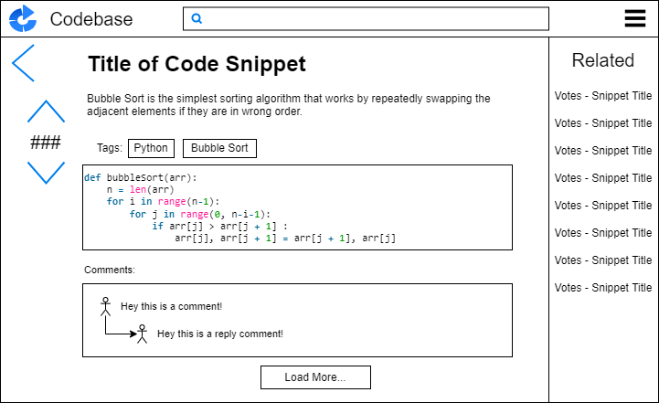

# User Interface Diagrams

## Home Page

The main home page for Codebase will include five primary components.

1. Navigation Bar: The navigation bar will serve as the holder of the primary search mechanism, this being the search bar. Users will be able to enter any string and a list of relevant public snippets will appear. It will also include a Codebase logo link which will allow users to return to the home page at any time. Lastly it contains a drop-down list on the right, which will contain functions such as return to profile page, logout, and create new snippet.
2. Top Tags: This will be a filtering mechanism on the left-hand side of the screen, users will be able to see currently trending tags and filter them into or out of there results.
3. Languages: Like Top Tags, Language will show users popular languages right now, and allow them to filter them out of there results.
4. Snippets: This will be the main content of the home screen and it will list trending snippets. Each snippet will be clickable and take the user to the specific snippet page. There will be a voting system for each post. Also in this section there will be a drop down with further filters and organizing tools.
5. Popular: Lastly, this will display the most popular posts from the last month regardless of given filters. It will allow for users to always see what is trending regardless of filters.

Primary filters like Languages and sort order will be saved as cookies for easier navigation for consistent users.

## Snippet Page

The snippet page for Codebase will include three primary components.

1. Navigation Bar: The navigation bar will serve as the holder of the primary search mechanism, this being the search bar. Users will be able to enter any string and a list of relevant public snippets will appear. It will also include a Codebase logo link which will allow users to return to the home page at any time. Lastly it contains a drop-down list on the right, which will contain functions such as return to profile page, logout, and create new snippet.
2. Snippet View: This is the primary content of the page, it will contain the code for the selected snippet, along with links to the posters profile, copy function, and comment section. It will also contain relevant information like tags and language.
3. Related: This will be a panel on the right-hand side which will show users posts that relate to the one they are currently looking at. This will be based of tags, title, contents of code, and total upvotes.

## User Page

The user page for Codebase will include three primary components.

1. Navigation Bar: The navigation bar will serve as the holder of the primary search mechanism, this being the search bar. Users will be able to enter any string and a list of relevant public snippets will appear. It will also include a Codebase logo link which will allow users to return to the home page at any time. Lastly it contains a drop-down list on the right, which will contain functions such as return to profile page, logout, and create new snippet.
2. User Information: This will contain the users profile picture, along with their username and a description. Also, a stats for nerds section outlining their contributions to Codebase.
3. Snippets: This section will contain all the users code snippets. If the user page belongs to the logged in user, it will have private and public along with editing tools for all. Viewing another user’s page will only show public posts along with information made public by the user.